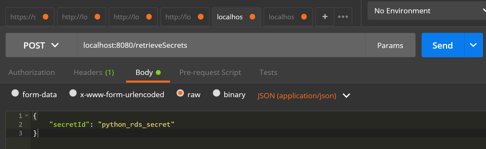
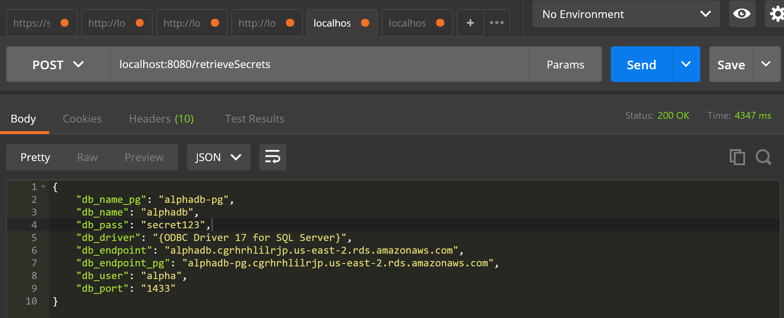

# Spring Cloud Function for AWS Lambda
### Retrieves Secret Values from the SecretsManager for the given Secret Id.

#### Run using the below command

`
    mvn clean spring-boot:run
`

#### Request: Provide the secretId and invoke POST endpoint

#### Response: Secret Values retrieved from AWS SecretsManager

