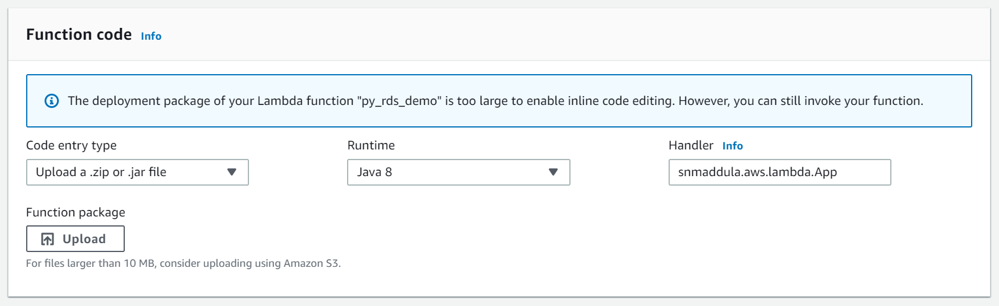

# Spring Cloud Function for AWS Lambda
### Retrieves Secret Values from the SecretsManager for the given Secret Id.

## Configuring Lambda Handler on AWS Console

### To Test Locally follow the below steps

#### 1. Run using the below command

`
    mvn clean spring-boot:run
`

#### 2. Request: Provide the secretId and invoke POST endpoint

#### 3. Response: Secret Values retrieved from AWS SecretsManager

